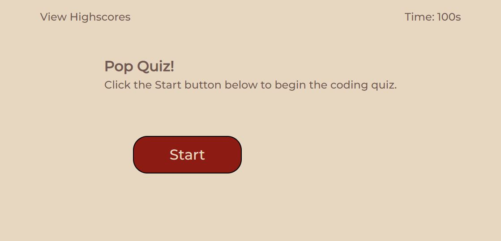

# Web Dev Pop Quiz

## Description

This project tested my ability to code something more complex in JS. It is a small timed coding quiz that calculates and stores a score. Unfortunately I wasn't able to complete it before the due date. But I will likely return to it in the future and amend the pieces that are not totally functional. For instance, highscores are not saved in the browser. Also I would like to offer the option of trying the quiz multiple times to get a better score. Currently these features are not available.

## Screenshot

